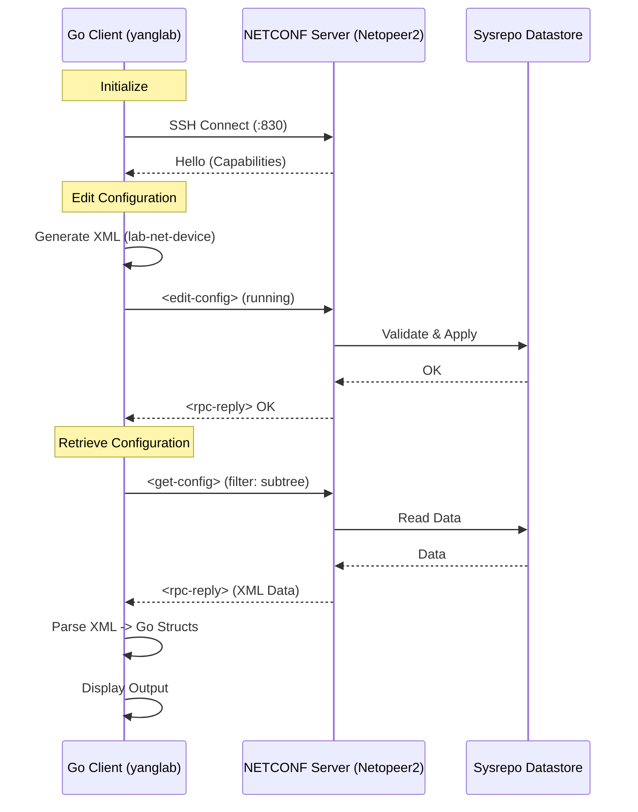

# YANG Lab

Hands-on NETCONF + YANG playground built with Go.

This repository shows how to:
- define a custom YANG model family (base + extensions + augment + identities + deviations)
- generate NETCONF `<edit-config>` payloads from Go structs
- push config to a running server (Netopeer2)
- retrieve and parse config back from `<get-config>`

## What Is Included

- `cmd/yanglab`: CLI demo that connects to NETCONF, sends config, and reads it back
- `internal/client`: minimal NETCONF client wrapper (`go-netconf`)
- `internal/models/labnetdevice`: model structs, XML generation, and parse helpers
- `yang/core/lab-net-device.yang`: custom YANG model used by the demo
- `yang/extensions/lab-net-device-extensions.yang`: custom extension keywords
- `yang/augments/lab-net-device-qos-augment.yang`: QoS augment (global policies + interface attach)
- `yang/identities/lab-net-device-extra-identities.yang`: extra identity values
- `yang/deviations/lab-net-device-deviations-srlinux.yang`: example platform deviations
- `cmd/api`: API skeleton (placeholder, not production-ready)

## Module Overview

- `lab-net-device` (`http://example.com/ns/lab-net-device`): base device model with `system`, `vlans`, `vrfs`, `interfaces`, `routing`, and `bgp`.
- `lab-net-device-extensions` (`http://example.com/ns/lab-net-device-extensions`): custom extension keywords used by the base module to annotate nodes (e.g., SQL export hints). These do not change NETCONF behavior by themselves.
- `lab-net-device-qos-augment` (`http://example.com/ns/lab-net-device-qos`): adds a global `qos` policy repository and augments `interfaces/interface` with a `qos` container. `input-policy` and `output-policy` are leafrefs with direction checks (`ingress` vs `egress`).
- `lab-net-device-extra-identities` (`http://example.com/ns/lab-net-device-identities`): adds new identity values that extend `lnd:if-purpose-idty` for `interfaces/interface/purpose` (e.g., `lndi:access-port`).
- `lab-net-device-deviations-srlinux` (`http://example.com/ns/lab-net-device-deviations/srlinux`): declares platform-specific not-supported nodes (`bgp/neighbor/vrf`, `interfaces/interface/bounce`, `interfaces/interface/switchport`). Client logic should omit these when targeting SR Linux.

Important: importing a module is not enough. The NETCONF server must load and advertise these modules (see the yang-library verification below).

## System Architecture

The following diagram illustrates the interaction between the Go client and the NETCONF server (Netopeer2):



## Enterprise Infographic

High-resolution technical infographic (A3 landscape, vector):


## Code Quality & Architecture

This project demonstrates several high-quality engineering practices in Go:

### 1. Modular Design
The codebase follows a clean "Standard Go Project Layout":
- **`cmd/`**: Contains the main applications. Usage logic is separated from library code.
- **`internal/`**:  Private application and library code.
    - **`client`**: A reusable, minimal wrapper around the SSH NETCONF session.
    - **`models`**: Domain logic and data structures.

### 2. Type-Safe YANG Modeling
Instead of working with raw maps or loosely typed data, we define **Go structs** that map to the YANG model subset used by the demo.
- **Benefits**: Compile-time safety, auto-completion, and clear data contracts.
- **XML Tags**: Struct fields use `xml:"..."` tags to ensure precise marshalling and unmarshalling that matches the NETCONF schema.

### 3. Robust Data Handling
The application handles real-world data intricacies:
- **Custom XML Unmarshalling**: The `labnetdevice.ParseConfig` function is designed to handle both `<config>` and `<data>` wrappers seamlessly.
- **Input Sanitization**: We implement custom logic (see `cleanCharData`) to strip invalid control characters or comments (like `#...`) that might corrupt numeric fields during parsing. This ensures the application is resilient to malformed input.

### 4. Explicit Error Handling
Errors are propagated up the stack and handled explicitly. We avoid silencing errors, ensuring that connection failures, XML generation issues, or parsing errors are clearly reported to the user.

## What is YANG?

**YANG** (Yet Another Next Generation) is a data modeling language used to model configuration and state data manipulated by the **NETCONF** protocol. It provides a structured, contract-based approach to network management, replacing unstructured CLI commands with precise data models.

In this project, YANG serves as the **Single Source of Truth** for:
- **Data Structure**: Defining hierarchy (nested containers, lists, leafs).
- **Data Constraints**: Enforcing valid ranges, patterns, and types (e.g., VLAN ID 1-4094, IPv4 format).
- **RPC Definitions**: Modeling operations like `bounce-interface`.
- **Notifications**: Defining events like link-state changes.

### The `lab-net-device` Model

We use a custom YANG module `lab-net-device` (prefix `lnd`) to simulate a realistic network device. Key components include:

- **`system`**: User management with role-based access (`admin`, `operator`, `readonly`).
- **`vlans`**: Layer 2 VLAN database with ID validation strings.
- **`vrfs`**: Virtual Routing and Forwarding instances with Route Distinguisher (RD) validation.
- **`interfaces`**: Physical and logical interfaces supporting:
    - **IPv4**: Address assignments and prefix lengths.
    - **Switchport**: Mode selection (`access`/`trunk`) and VLAN membership.
    - **Actions**: Custom RPCs like `bounce` to simulate interface resets.
- **`routing`**: Static routes with next-hop validation (IP or outgoing interface).
- **`bgp`**: Basic BGP configuration including neighbors and AS numbers (supporting both 2-byte and 4-byte ASNs via `union`).

The demo Go structs in `internal/models/labnetdevice` cover the base module plus the QoS augment and identityref values. Optional leaves, actions, and notifications are not fully modeled.


## Prerequisites

- Docker
- Go `1.25+` (see `go.mod`)
- Open port `830` on localhost

## Quick Start

### 1. Start Netopeer2

```bash
docker run -d --name netopeer2 -p 830:830 sysrepo/sysrepo-netopeer2:latest
```

Optional: wait until the server is fully up.

```bash
docker logs -f netopeer2
```

### 2. Install the YANG modules into Sysrepo (ordered)

Order matters because `lab-net-device` imports `lab-net-device-extensions`, and the other modules depend on the base model.

```bash
docker cp yang/extensions/lab-net-device-extensions.yang netopeer2:/tmp/
docker cp yang/core/lab-net-device.yang netopeer2:/tmp/
docker cp yang/augments/lab-net-device-qos-augment.yang netopeer2:/tmp/
docker cp yang/identities/lab-net-device-extra-identities.yang netopeer2:/tmp/
docker cp yang/deviations/lab-net-device-deviations-srlinux.yang netopeer2:/tmp/

docker exec -it netopeer2 sysrepoctl -i /tmp/lab-net-device-extensions.yang
docker exec -it netopeer2 sysrepoctl -i /tmp/lab-net-device.yang
docker exec -it netopeer2 sysrepoctl -i /tmp/lab-net-device-qos-augment.yang
docker exec -it netopeer2 sysrepoctl -i /tmp/lab-net-device-extra-identities.yang
docker exec -it netopeer2 sysrepoctl -i /tmp/lab-net-device-deviations-srlinux.yang
```

Optional check:

```bash
docker exec -it netopeer2 sysrepoctl -l
```

You should see `lab-net-device` plus the augment/identity/deviation modules in the list.

Quick verification (NETCONF, yang-library):

```xml
<get>
  <filter type="subtree">
    <yang-library xmlns="urn:ietf:params:xml:ns:yang:ietf-yang-library"/>
  </filter>
</get>
```

### 3. Run the CLI demo

```bash
go mod tidy
go run ./cmd/yanglab
```

The demo currently defaults to the SR Linux deviation profile in `cmd/yanglab/main.go`.
This omits `switchport` and BGP `vrf` from generated config (because the deviation marks them as `not-supported`).
Set `deviceProfile` to `default` if you are not loading the deviations module.

Default NETCONF credentials used by the demo:
- host: `127.0.0.1:830`
- username: `netconf`
- password: `netconf`

### 4. (Optional) Run the API skeleton

```bash
go run cmd/api/main.go
```

Current endpoint:
- `GET /api/v1/network` (placeholder response)

## Expected Flow

`cmd/yanglab/main.go` performs:

1. NETCONF SSH connect
2. `<edit-config>` with generated XML from demo data
3. `<get-config>` with subtree filter for:
   - `vlans`
   - `vrfs`
   - `qos`
   - `interfaces`
   - `routing`
   - `bgp`
   - `system`
4. parse returned XML into Go structs and print selected values

## Validate the YANG Modules (Optional)

If you want static validation/lint before loading the module:

```bash
python -m pip install --upgrade pip
python -m pip install pyang
python -m pyang -p yang/core -p yang/extensions -p yang/augments -p yang/identities -p yang/deviations -f tree yang/core/lab-net-device.yang
python -m pyang -p yang/core -p yang/extensions -p yang/augments -p yang/identities -p yang/deviations --lint yang/core/lab-net-device.yang
python -m pyang -p yang/core -p yang/extensions -p yang/augments -p yang/identities -p yang/deviations --lint yang/augments/lab-net-device-qos-augment.yang
python -m pyang -p yang/core -p yang/extensions -p yang/augments -p yang/identities -p yang/deviations --lint yang/identities/lab-net-device-extra-identities.yang
python -m pyang -p yang/core -p yang/extensions -p yang/augments -p yang/identities -p yang/deviations --lint yang/deviations/lab-net-device-deviations-srlinux.yang
python -m pyang -p yang/core -p yang/extensions -p yang/augments -p yang/identities -p yang/deviations --lint yang/extensions/lab-net-device-extensions.yang
```

## Troubleshooting

- `unexpected namespace` errors:
  - verify the exact module namespace in `yang/core/lab-net-device.yang`
  - ensure the loaded module in Sysrepo matches current file contents
- `wrong revision ("none" instead "2026-02-09")` when installing identities/deviations:
  - update the base module in Sysrepo and then reinstall dependents:

```bash
docker exec -it netopeer2 sysrepoctl -U /tmp/lab-net-device.yang
docker exec -it netopeer2 sysrepoctl -i /tmp/lab-net-device-extra-identities.yang
docker exec -it netopeer2 sysrepoctl -i /tmp/lab-net-device-deviations-srlinux.yang
```

  - if update is not supported, uninstall and reinstall in order:

```bash
docker exec -it netopeer2 sysrepoctl -u lab-net-device-extra-identities
docker exec -it netopeer2 sysrepoctl -u lab-net-device-deviations-srlinux
docker exec -it netopeer2 sysrepoctl -u lab-net-device-qos-augment
docker exec -it netopeer2 sysrepoctl -u lab-net-device
docker exec -it netopeer2 sysrepoctl -u lab-net-device-extensions
```
- `Edit-Config Failed: ... NACM authorization failed`:
  - this is expected with default Netopeer2 setup, because NACM denies writes for non-recovery users by default
  - quick demo fix: disable NACM in `running` and `startup` (not for production)

```powershell
@'
<nacm xmlns="urn:ietf:params:xml:ns:yang:ietf-netconf-acm">
  <enable-nacm>false</enable-nacm>
</nacm>
'@ | Set-Content -Path .\disable-nacm.xml

docker cp .\disable-nacm.xml netopeer2:/tmp/disable-nacm.xml
docker exec -it netopeer2 sysrepocfg --import=/tmp/disable-nacm.xml --datastore=running --module=ietf-netconf-acm --format=xml
docker exec -it netopeer2 sysrepocfg --import=/tmp/disable-nacm.xml --datastore=startup --module=ietf-netconf-acm --format=xml
```

  - safer alternative: keep NACM enabled and add proper `ietf-netconf-acm` rules for your NETCONF user
- connection errors:
  - confirm container is running and port `830` is mapped

## Project Layout

- `cmd/yanglab/main.go`: CLI entrypoint
- `cmd/yanglab/demo_data.go`: sample payload data
- `cmd/api/main.go`: API skeleton
- `internal/client/client.go`: NETCONF session wrapper
- `internal/models/labnetdevice/labnetdevice.go`: model structs and XML helpers
- `yang/core/lab-net-device.yang`: base YANG module
- `yang/extensions/lab-net-device-extensions.yang`: custom extensions
- `yang/augments/lab-net-device-qos-augment.yang`: QoS augment module
- `yang/identities/lab-net-device-extra-identities.yang`: extra identities
- `yang/deviations/lab-net-device-deviations-srlinux.yang`: example deviations
