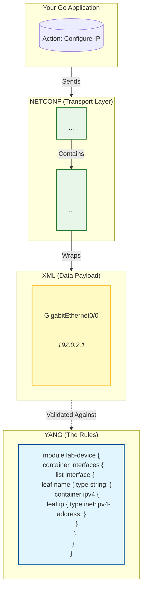
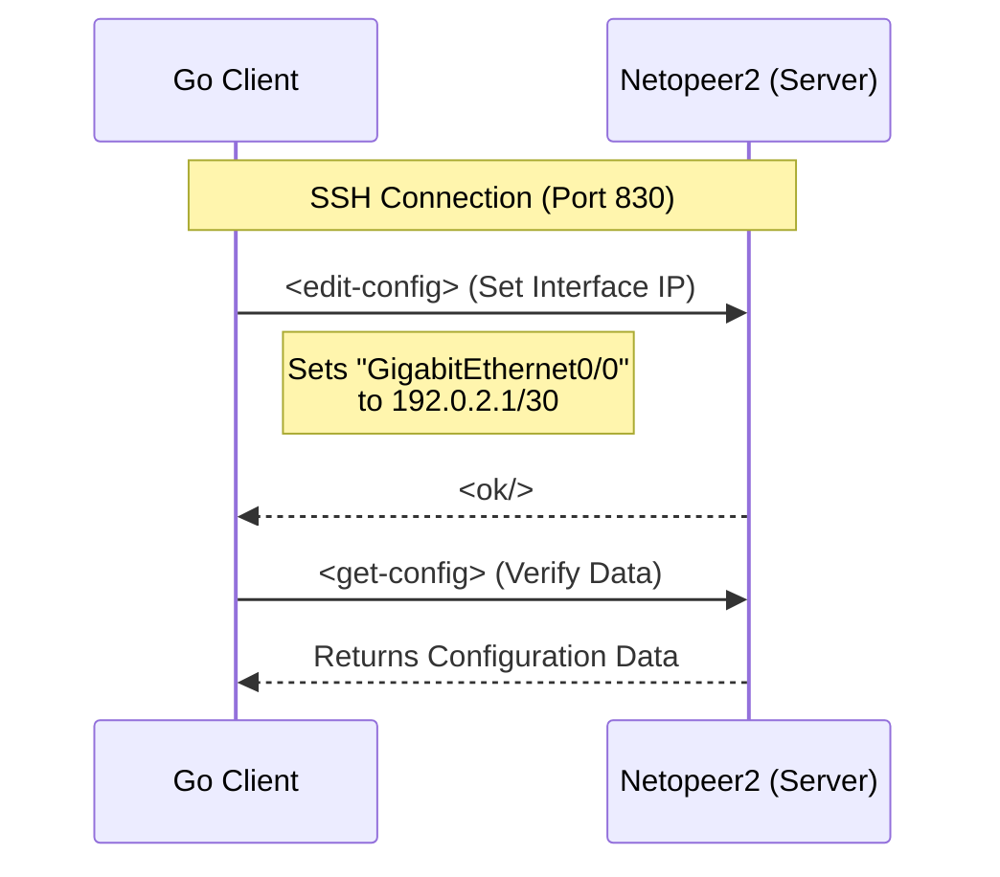

# YANG Lab

A simple, hands-on playground to understand **NETCONF**, **YANG**, and **Go**.

This project demonstrates how to configure a network device programmatically using a custom YANG model (`lab-device.yang`) and a Go client.

---

## Architecture

This diagram shows how **YANG** (the rules), **XML** (the data), and **NETCONF** (the transport) work together.



---

## Workflow Visualization

Here is the sequence of events:



---

## Quick Start

Follow these simple steps to get everything running.

### 1. Start the Server (Docker)
Run the standard Netopeer2 container (NETCONF server).

```bash
docker run -d --name netopeer2 -p 830:830 sysrepo/sysrepo-netopeer2:latest
```

### 2. Install the YANG Model
Upload and install our custom device model (`lab-device.yang`) into the server.

```bash
# 1. Copy the YANG file to the container
docker cp yang/lab-device.yang netopeer2:/tmp/

# 2. Install the model using sysrepoctl
docker exec -it netopeer2 sysrepoctl -i /tmp/lab-device.yang
```

*(Optional)* If you face permission errors, you might need to disable NACM (NETCONF Access Control Model) inside the container.

### 3. Run the Go Client
Now, run the client to push configuration and verify it.

```bash
# Install dependencies
go mod tidy

# Run the client
go run cmd/main.go
```

---

## Project Structure

- **`yang/lab-device.yang`**: The custom data model defining our device's interface.
- **`cmd/main.go`**: The Go application that acts as the NETCONF client.

---

### Enjoy your automation!