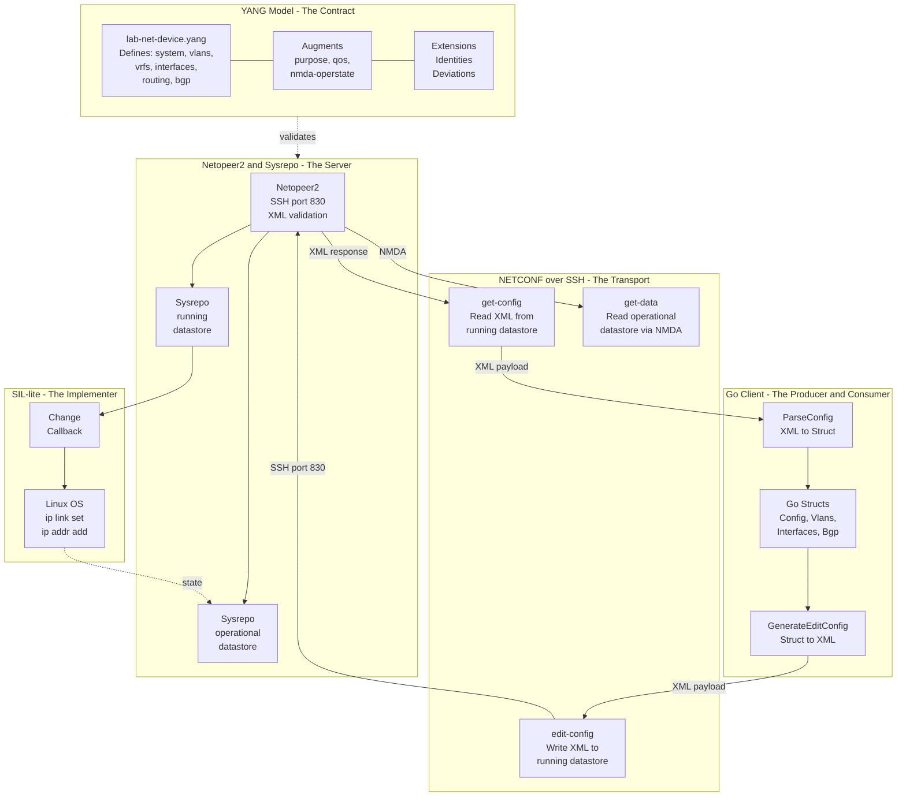
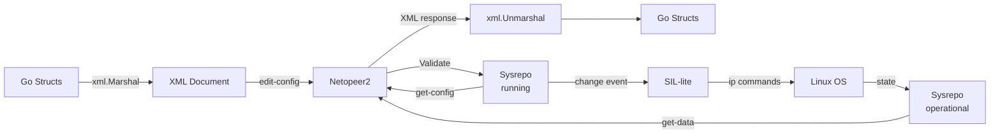
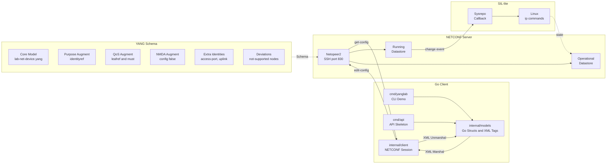

# YANG Lab

Hands-on NETCONF + YANG playground built with Go.

## Note

This repository was generated with the help of AI. The goal is to provide a working example of YANG modeling so readers
can understand how it works. Respectfully.

## Purpose and Narrative

This lab teaches thinking of the YANG model as a contract, NETCONF as the transport, and SIL as the implementer.
Examples are small but map directly to real-world concepts.

In this repo you will see:
- YANG core model + augment + identity/identityref + deviations
- NETCONF `<edit-config>` writes and `<get-config>` reads
- NMDA idea: config and state in the same tree, with state as `config false` in the operational datastore
- Pre-provisioning: config exists but operational does not (planning without hardware)
- SIL-lite: a bridge that applies Sysrepo changes to Linux `ip` commands

## Data Model Overview

The core model `lab-net-device` includes:
- `system`: user/role management (admin/operator/readonly)
- `vlans`: VLAN definitions (range and pattern examples)
- `vrfs`: VRF definitions (rd format)
- `interfaces`: interfaces (name pattern, MTU range, IPv4 subtrees)
- `routing`: static routes and next-hop choice example
- `bgp`: neighbors and ASN union example

Augment modules extend the core tree:
- `purpose` (identityref): extensible value set
- `qos` augment: leafref + must constraints
- `nmda-operstate` augment: `config false` state (oper-status, counters, etc.)

The deviations module shows platform profile differences (e.g., nodes not supported on SR Linux).
This repository shows how to:
- define a custom YANG model family (base + extensions + augment + identities + deviations)
- generate NETCONF `<edit-config>` payloads from Go structs
- push config to a running server (Netopeer2)
- retrieve and parse config back from `<get-config>`

## What Is Included

- `cmd/yanglab`: CLI demo that connects to NETCONF, sends config, and reads it back
- `internal/client`: minimal NETCONF client wrapper (`go-netconf`)
- `internal/models/labnetdevice`: model structs, XML generation, and parse helpers
- `sil-lite`: minimal Sysrepo subscriber that applies config to Linux (`ip` commands)
- `yang/core/lab-net-device.yang`: custom YANG model used by the demo
- `yang/extensions/lab-net-device-extensions.yang`: custom extension keywords
- `yang/augments/lab-net-device-purpose-augment.yang`: purpose augment (identityref)
- `yang/augments/lab-net-device-nmda-operstate-augment.yang`: NMDA oper-state augment (config false)
- `yang/augments/lab-net-device-qos-augment.yang`: QoS augment (global policies + interface attach)
- `yang/identities/lab-net-device-extra-identities.yang`: extra identity values
- `yang/deviations/lab-net-device-deviations-srlinux.yang`: example platform deviations
- `cmd/api`: API skeleton (placeholder, not production-ready)

## Module Overview

- `lab-net-device` (`http://example.com/ns/lab-net-device`): base device model with `system`, `vlans`, `vrfs`, `interfaces`, `routing`, and `bgp`.
- `lab-net-device-extensions` (`http://example.com/ns/lab-net-device-extensions`): custom extension keywords used by the base module to annotate nodes (e.g., SQL export hints). These do not change NETCONF behavior by themselves.
- `lab-net-device-purpose-augment` (`http://example.com/ns/lab-net-device-purpose`): augments `interfaces/interface` with `purpose` using `identityref` (extensible value set).
- `lab-net-device-nmda-operstate-augment` (`http://example.com/ns/lab-net-device-operstate`): augments `interfaces/interface` with config-false operational leaves (NMDA-style).
- `lab-net-device-qos-augment` (`http://example.com/ns/lab-net-device-qos`): adds a global `qos` policy repository and augments `interfaces/interface` with a `qos` container. `input-policy` and `output-policy` are leafrefs with direction checks (`ingress` vs `egress`).
- `lab-net-device-extra-identities` (`http://example.com/ns/lab-net-device-identities`): adds new identity values that extend `lnd:if-purpose-idty` for `interfaces/interface/purpose` (e.g., `lndi:access-port`).
- `lab-net-device-deviations-srlinux` (`http://example.com/ns/lab-net-device-deviations/srlinux`): declares platform-specific not-supported nodes (`bgp/neighbor/vrf`, `interfaces/interface/bounce`, `interfaces/interface/switchport`). Client logic should omit these when targeting SR Linux.

Important: importing a module is not enough. The NETCONF server must load and advertise these modules (see the yang-library verification below).

## How It All Fits Together

The diagram below shows the **conceptual relationship** between YANG, NETCONF, XML, and the Go client/server in this project:



## Data Flow



**Core flow:**
- Go side: structs to XML via `GenerateEditConfig`
- NETCONF `<edit-config>` writes config
- Sysrepo validates and applies the config
- `<get-config>` reads config only
- `<get>` returns config + state (if supported by the server)
- `<get-data>` fetches the NMDA operational datastore separately (if supported)

**NMDA idea:**
- The same node can carry both config and state.
- State leaves are `config false` and become meaningful in the operational datastore.
- In pre-provisioning, the interface exists in config but not in operational state; `hardware-present=false` or missing/`down` `oper-status` can appear.

## System Architecture

The following sequence diagram shows the **full NETCONF session lifecycle** with XML payloads:

```mermaid
sequenceDiagram
    participant CLI as Go Client
    participant NC as Netopeer2
    participant SR as Sysrepo
    participant SIL as SIL-lite

    rect rgb(40, 40, 60)
    Note over CLI,NC: Phase 1 - Connection
    CLI->>NC: SSH Connect port 830
    NC-->>CLI: NETCONF Hello and Capabilities
    CLI->>NC: Client Hello
    end

    rect rgb(30, 60, 40)
    Note over CLI,SR: Phase 2 - Push Configuration
    CLI->>CLI: GenerateEditConfig
    Note right of CLI: Go Structs to XML
    CLI->>NC: edit-config and XML payload
    NC->>SR: Validate against YANG schema
    SR-->>NC: OK
    NC-->>CLI: rpc-reply OK
    SR->>SIL: Change notification
    SIL->>SIL: Apply to Linux OS
    end

    rect rgb(30, 40, 70)
    Note over CLI,SR: Phase 3 - Retrieve Configuration
    CLI->>NC: get-config and subtree filter
    NC->>SR: Read running datastore
    SR-->>NC: XML data
    NC-->>CLI: rpc-reply and XML data
    CLI->>CLI: ParseConfig
    Note right of CLI: XML to Go Structs
    CLI->>CLI: Display parsed data
    end

    rect rgb(60, 40, 40)
    Note over CLI,SR: Phase 4 - NMDA State - Optional
    CLI->>NC: get-data datastore=operational
    NC->>SR: Read operational datastore
    SR-->>NC: Config and State XML
    NC-->>CLI: rpc-reply and state data
    Note right of CLI: oper-status, counters, hardware-present
    end
```



## Project Architecture (Detailed Diagram)



**Key points:**
- The model layer (struct + YANG) defines the contract.
- NETCONF carries config data to the server over SSH.
- Sysrepo stores config and exposes operational state.
- SIL-lite applies config to the real system.

## Enterprise Infographic

High-resolution technical infographic (A3 landscape, vector):


## Code Quality & Architecture

This project demonstrates several high-quality engineering practices in Go:

### 1. Modular Design
The codebase follows a clean "Standard Go Project Layout":
- **`cmd/`**: Contains the main applications. Usage logic is separated from library code.
- **`internal/`**:  Private application and library code.
    - **`client`**: A reusable, minimal wrapper around the SSH NETCONF session.
    - **`models`**: Domain logic and data structures.

### 2. Type-Safe YANG Modeling
Instead of working with raw maps or loosely typed data, we define **Go structs** that map to the YANG model subset used by the demo.
- **Benefits**: Compile-time safety, auto-completion, and clear data contracts.
- **XML Tags**: Struct fields use `xml:"..."` tags to ensure precise marshalling and unmarshalling that matches the NETCONF schema.

### 3. Robust Data Handling
The application handles real-world data intricacies:
- **Custom XML Unmarshalling**: The `labnetdevice.ParseConfig` function is designed to handle both `<config>` and `<data>` wrappers seamlessly.
- **Input Sanitization**: We implement custom logic (see `cleanCharData`) to strip invalid control characters or comments (like `#...`) that might corrupt numeric fields during parsing. This ensures the application is resilient to malformed input.

### 4. Explicit Error Handling
Errors are propagated up the stack and handled explicitly. We avoid silencing errors, ensuring that connection failures, XML generation issues, or parsing errors are clearly reported to the user.

## What is YANG?

**YANG** (Yet Another Next Generation) is a data modeling language used to model configuration and state data manipulated by the **NETCONF** protocol. It provides a structured, contract-based approach to network management, replacing unstructured CLI commands with precise data models.

In this project, YANG serves as the **Single Source of Truth** for:
- **Data Structure**: Defining hierarchy (nested containers, lists, leafs).
- **Data Constraints**: Enforcing valid ranges, patterns, and types (e.g., VLAN ID 1-4094, IPv4 format).
- **RPC Definitions**: Modeling operations like `bounce-interface`.
- **Notifications**: Defining events like link-state changes.

### The `lab-net-device` Model

We use a custom YANG module `lab-net-device` (prefix `lnd`) to simulate a realistic network device. Key components include:

- **`system`**: User management with role-based access (`admin`, `operator`, `readonly`).
- **`vlans`**: Layer 2 VLAN database with ID validation strings.
- **`vrfs`**: Virtual Routing and Forwarding instances with Route Distinguisher (RD) validation.
- **`interfaces`**: Physical and logical interfaces supporting:
    - **IPv4**: Address assignments and prefix lengths.
    - **Switchport**: Mode selection (`access`/`trunk`) and VLAN membership.
    - **Actions**: Custom RPCs like `bounce` to simulate interface resets.
- **`routing`**: Static routes with next-hop validation (IP or outgoing interface).
- **`bgp`**: Basic BGP configuration including neighbors and AS numbers (supporting both 2-byte and 4-byte ASNs via `union`).

The demo Go structs in `internal/models/labnetdevice` cover the base module plus the purpose, QoS, and NMDA oper-state augments and identityref values. Optional leaves, actions, and notifications are not fully modeled.


## Prerequisites

- Docker
- Go `1.25+` (see `go.mod`)
- Open port `830` on localhost

## Quick Start

### 1. Start Netopeer2

```bash
docker run -d --name netopeer2 -p 830:830 sysrepo/sysrepo-netopeer2:latest
```

Optional: wait until the server is fully up.

```bash
docker logs -f netopeer2
```

### 2. Install the YANG modules into Sysrepo (ordered)

Order matters because `lab-net-device` imports `lab-net-device-extensions`, and the other modules depend on the base model.

```bash
docker cp yang/extensions/lab-net-device-extensions.yang netopeer2:/tmp/
docker cp yang/core/lab-net-device.yang netopeer2:/tmp/
docker cp yang/augments/lab-net-device-purpose-augment.yang netopeer2:/tmp/
docker cp yang/augments/lab-net-device-nmda-operstate-augment.yang netopeer2:/tmp/
docker cp yang/augments/lab-net-device-qos-augment.yang netopeer2:/tmp/
docker cp yang/identities/lab-net-device-extra-identities.yang netopeer2:/tmp/
docker cp yang/deviations/lab-net-device-deviations-srlinux.yang netopeer2:/tmp/

docker exec -it netopeer2 sysrepoctl -i /tmp/lab-net-device-extensions.yang
docker exec -it netopeer2 sysrepoctl -i /tmp/lab-net-device.yang
docker exec -it netopeer2 sysrepoctl -i /tmp/lab-net-device-purpose-augment.yang
docker exec -it netopeer2 sysrepoctl -i /tmp/lab-net-device-nmda-operstate-augment.yang
docker exec -it netopeer2 sysrepoctl -i /tmp/lab-net-device-qos-augment.yang
docker exec -it netopeer2 sysrepoctl -i /tmp/lab-net-device-extra-identities.yang
docker exec -it netopeer2 sysrepoctl -i /tmp/lab-net-device-deviations-srlinux.yang
```

Optional check:

```bash
docker exec -it netopeer2 sysrepoctl -l
```

You should see `lab-net-device` plus the augment/identity/deviation modules in the list.

Quick verification (NETCONF, yang-library):

```xml
<get>
  <filter type="subtree">
    <yang-library xmlns="urn:ietf:params:xml:ns:yang:ietf-yang-library"/>
  </filter>
</get>
```

### 3. Run the CLI demo

```bash
go mod tidy
go run ./cmd/yanglab
```

Optional: choose retrieval mode (NMDA demos):

```bash
go run ./cmd/yanglab -mode get       # config + state (if server includes state in <get>)
go run ./cmd/yanglab -mode get-data  # NMDA operational datastore (if supported)
go run ./cmd/yanglab -preprov        # add pre-provisioned interface to config
go run ./cmd/yanglab -preprov -mode get
```

The demo currently defaults to the SR Linux deviation profile in `cmd/yanglab/main.go`.
This omits `switchport` and BGP `vrf` from generated config (because the deviation marks them as `not-supported`).
Set `deviceProfile` to `default` if you are not loading the deviations module.

Default NETCONF credentials used by the demo:
- host: `127.0.0.1:830`
- username: `netconf`
- password: `netconf`

### 4. (Optional) Run the API skeleton

```bash
go run cmd/api/main.go
```

Current endpoint:
- `GET /api/v1/network` (placeholder response)

## Expected Flow

`cmd/yanglab/main.go` performs:

1. NETCONF SSH connect
2. `<edit-config>` with generated XML from demo data
3. `<get-config>` with subtree filter for:
   - `vlans`
   - `vrfs`
   - `qos`
   - `interfaces`
   - `routing`
   - `bgp`
   - `system`
4. parse returned XML into Go structs and print selected values

## Pre-Provisioning Demo (NMDA)

Goal: show "config exists, operational absent/false".

1. Run with a pre-provisioned interface added to config:

```bash
go run ./cmd/yanglab -preprov
```

2. Fetch state:

```bash
go run ./cmd/yanglab -preprov -mode get
```

Expected (server-dependent):
- `GigabitEthernet1/1` appears in config.
- In operational state, `hardware-present` may be `false`, and `oper-status` may be missing or `down` if the server has no real port.

This demonstrates NMDA: the same node exists in config but is not active in operational state.

## SIL-lite (Sysrepo Subscriber)

SIL-lite is a minimal "System Integration Layer" example that listens to Sysrepo changes and
applies them to the OS via `ip` commands.

Quick run (dry-run mode):

```bash
cd sil-lite
gcc -Wall -Wextra -O2 -o sil-lite sil_lite.c -lsysrepo
./sil-lite
```

Then in another terminal:

```bash
go run ./cmd/yanglab
```

Set `SIL_LITE_APPLY=1` to execute real `ip` commands instead of dry-run.

It reacts to:
- `interfaces/interface/enabled`
- `interfaces/interface/ipv4/address/prefix-length`

See `sil-lite/README.md` for details.

## Validate the YANG Modules (Optional)

If you want static validation/lint before loading the module:

```bash
python -m pip install --upgrade pip
python -m pip install pyang
python -m pyang -p yang/core -p yang/extensions -p yang/augments -p yang/identities -p yang/deviations -f tree yang/core/lab-net-device.yang
python -m pyang -p yang/core -p yang/extensions -p yang/augments -p yang/identities -p yang/deviations --lint yang/core/lab-net-device.yang
python -m pyang -p yang/core -p yang/extensions -p yang/augments -p yang/identities -p yang/deviations --lint yang/augments/lab-net-device-purpose-augment.yang
python -m pyang -p yang/core -p yang/extensions -p yang/augments -p yang/identities -p yang/deviations --lint yang/augments/lab-net-device-nmda-operstate-augment.yang
python -m pyang -p yang/core -p yang/extensions -p yang/augments -p yang/identities -p yang/deviations --lint yang/augments/lab-net-device-qos-augment.yang
python -m pyang -p yang/core -p yang/extensions -p yang/augments -p yang/identities -p yang/deviations --lint yang/identities/lab-net-device-extra-identities.yang
python -m pyang -p yang/core -p yang/extensions -p yang/augments -p yang/identities -p yang/deviations --lint yang/deviations/lab-net-device-deviations-srlinux.yang
python -m pyang -p yang/core -p yang/extensions -p yang/augments -p yang/identities -p yang/deviations --lint yang/extensions/lab-net-device-extensions.yang
```

## Troubleshooting

- `unexpected namespace` errors:
  - verify the exact module namespace in `yang/core/lab-net-device.yang`
  - ensure the loaded module in Sysrepo matches current file contents
- `wrong revision ("none" instead "2026-02-11")` when installing identities/deviations:
  - update the base module in Sysrepo and then reinstall dependents:

```bash
docker exec -it netopeer2 sysrepoctl -U /tmp/lab-net-device.yang
docker exec -it netopeer2 sysrepoctl -i /tmp/lab-net-device-extra-identities.yang
docker exec -it netopeer2 sysrepoctl -i /tmp/lab-net-device-deviations-srlinux.yang
```

  - if update is not supported, uninstall and reinstall in order:

```bash
docker exec -it netopeer2 sysrepoctl -u lab-net-device-extra-identities
docker exec -it netopeer2 sysrepoctl -u lab-net-device-deviations-srlinux
docker exec -it netopeer2 sysrepoctl -u lab-net-device-purpose-augment
docker exec -it netopeer2 sysrepoctl -u lab-net-device-nmda-operstate-augment
docker exec -it netopeer2 sysrepoctl -u lab-net-device-qos-augment
docker exec -it netopeer2 sysrepoctl -u lab-net-device
docker exec -it netopeer2 sysrepoctl -u lab-net-device-extensions
```
- `Edit-Config Failed: ... NACM authorization failed`:
  - this is expected with default Netopeer2 setup, because NACM denies writes for non-recovery users by default
  - quick demo fix: disable NACM in `running` and `startup` (not for production)

```powershell
@'
<nacm xmlns="urn:ietf:params:xml:ns:yang:ietf-netconf-acm">
  <enable-nacm>false</enable-nacm>
</nacm>
'@ | Set-Content -Path .\disable-nacm.xml

docker cp .\disable-nacm.xml netopeer2:/tmp/disable-nacm.xml
docker exec -it netopeer2 sysrepocfg --import=/tmp/disable-nacm.xml --datastore=running --module=ietf-netconf-acm --format=xml
docker exec -it netopeer2 sysrepocfg --import=/tmp/disable-nacm.xml --datastore=startup --module=ietf-netconf-acm --format=xml
```

  - safer alternative: keep NACM enabled and add proper `ietf-netconf-acm` rules for your NETCONF user
- connection errors:
  - confirm container is running and port `830` is mapped

## Project Layout

- `cmd/yanglab/main.go`: CLI entrypoint
- `cmd/yanglab/demo_data.go`: sample payload data
- `cmd/api/main.go`: API skeleton
- `internal/client/client.go`: NETCONF session wrapper
- `internal/models/labnetdevice/labnetdevice.go`: model structs and XML helpers
- `sil-lite/sil_lite.c`: minimal Sysrepo subscriber (SIL-lite)
- `yang/core/lab-net-device.yang`: base YANG module
- `yang/extensions/lab-net-device-extensions.yang`: custom extensions
- `yang/augments/lab-net-device-purpose-augment.yang`: purpose augment module
- `yang/augments/lab-net-device-nmda-operstate-augment.yang`: NMDA oper-state augment module
- `yang/augments/lab-net-device-qos-augment.yang`: QoS augment module
- `yang/identities/lab-net-device-extra-identities.yang`: extra identities
- `yang/deviations/lab-net-device-deviations-srlinux.yang`: example deviations

## YANG Terminology and Structures (Quick Reference)

This section summarizes the YANG terms used in this project and points to concrete examples in the codebase.

**Core data nodes**
- `container`: Groups related data nodes. Example: `system`, `vlans`, `interfaces` in `yang/core/lab-net-device.yang`.
- `list`: Repeated entries with keys. Example: `interfaces/interface` keyed by `name`.
- `leaf`: Single value. Example: `interfaces/interface/enabled`, `mtu`, `vrf`.
- `choice` + `case`: Mutually exclusive branches. Example: `routing/static-routes/route/(next-hop)` with `next-hop-ip` vs `outgoing-interface`.

**Types and constraints**
- `typedef`: Reusable type definitions. Example: `interface-name`, `vlan-id`, `mtu-type`.
- `pattern`: Regex validation. Example: interface name pattern in `interface-name`, VRF name pattern in `vrf-name`.
- `range`: Numeric bounds. Example: VLAN ID `1..4094`, MTU `576..9216`.
- `union`: Multiple allowed types. Example: `asn` supports 2-byte and 4-byte ranges.
- `enumeration`: Controlled set of values. Example: `user-role`, `switchport/mode`.
- `identity` + `identityref`: Extensible value sets. Example base identity `if-purpose-idty` and values in `lab-net-device-extra-identities.yang`.

**References and constraints**
- `key`: Uniqueness of list entries. Example: `interfaces/interface` keyed by `name`.
- `leafref`: Reference to another leaf. Example: `interfaces/interface/vrf` -> `/vrfs/vrf/name`.
- `must`: Additional constraint. Example: QoS policy direction checks in `lab-net-device-qos-augment.yang`.
- `when`: Conditional presence. Example: `switchport/access-vlan` only when `mode = 'access'`.
- `unique`: Ensures uniqueness inside a list. Example: `qos/policy/class/class-name`.

**Augment and deviation**
- `augment`: Extends an existing data tree.
- Example: `lab-net-device-purpose-augment.yang` adds `interfaces/interface/purpose`.
- Example: `lab-net-device-nmda-operstate-augment.yang` adds operational leaves (`config false`).
- Example: `lab-net-device-qos-augment.yang` adds `qos` repository and interface QoS.
- `deviation`: Platform-specific changes. Example: `lab-net-device-deviations-srlinux.yang` marks nodes as `not-supported`.

**Operations and events**
- `rpc`: Top-level remote procedure call. Examples: `add-user`, `delete-user`.
- `action`: Per-instance operation. Example: `interfaces/interface/bounce`.
- `notification`: Async event. Example: `interface-state-change`, `user-change`.

**NMDA concepts**
- `config true` vs `config false`: Configuration vs operational state. The NMDA augment adds `config false` leaves such as `oper-status`.
- `running` vs `operational` datastore: Config lives in `running`; state is read from `operational`.
- Pre-provisioning: Config exists without hardware; `hardware-present=false` or `oper-status` missing/`down`.

**Namespaces and prefixes**
- Each module defines a namespace and prefix.
- Example: `lnd` -> `http://example.com/ns/lab-net-device`
- Example: `lndq` -> `http://example.com/ns/lab-net-device-qos`
- Example: `lndi` -> `http://example.com/ns/lab-net-device-identities`
- Example: `lndo` -> `http://example.com/ns/lab-net-device-operstate`

**NETCONF operations used here**
- `<edit-config>`: Writes config (see `cmd/yanglab/main.go`).
- `<get-config>`: Reads config only.
- `<get>`: Reads config + state if supported.
- `<get-data>`: NMDA operational datastore if supported.

**How this maps to Go**
- YANG containers/lists map to Go structs and slices in `internal/models/labnetdevice/labnetdevice.go`.
- XML tags on struct fields ensure correct NETCONF serialization.
- `GenerateEditConfig` builds `<config>` payloads.
- `ParseConfig` parses `<data>` or `<config>` replies into Go structs.

**SIL (System Integration Layer) in this repo**
- `sil-lite/sil_lite.c` subscribes to Sysrepo changes and applies them to Linux via `ip` commands.
- This shows the "contract (YANG) -> transport (NETCONF) -> implementer (SIL)" chain in action.

## Worked Examples (From This Repo)

**Example 1: Identity + identityref via augment**
Source: `yang/augments/lab-net-device-purpose-augment.yang`
```yang
augment "/lnd:interfaces/lnd:interface" {
  leaf purpose {
    type identityref { base lnd:if-purpose-idty; }
    description "Interface purpose.";
  }
}
```
Source: `yang/identities/lab-net-device-extra-identities.yang`
```yang
identity uplink {
  base lnd:if-purpose-idty;
  description "Uplink to distribution/core.";
}
```

**Example 2: leafref + must constraint**
Source: `yang/augments/lab-net-device-qos-augment.yang`
```yang
leaf input-policy {
  type leafref {
    path "/lndq:qos/lndq:policy/lndq:name";
  }
  must "/lndq:qos/lndq:policy[lndq:name = current()]/lndq:direction = 'ingress'" {
    error-message "input-policy must reference a policy with direction 'ingress'.";
  }
}
```

**Example 3: NMDA oper-state (config false)**
Source: `yang/augments/lab-net-device-nmda-operstate-augment.yang`
```yang
leaf oper-status {
  config false;
  type enumeration { enum up; enum down; enum testing; }
  description "Actual link status.";
}
leaf hardware-present {
  config false;
  type boolean;
  description "True if hardware exists; false => pre-provisioned config possible.";
}
```

**Example 4: Go struct mapping**
Source: `internal/models/labnetdevice/labnetdevice.go`
```go
type Interface struct {
  Name            string  `xml:"name"`
  Purpose         *Purpose `xml:"purpose,omitempty"`
  OperStatus      string  `xml:"oper-status,omitempty"`
  HardwarePresent *bool   `xml:"hardware-present,omitempty"`
}
```

**Example 5: Pre-provisioning demo data**
Source: `cmd/yanglab/demo_data.go`
```go
if preprov {
  interfaces.Interface = append(interfaces.Interface, labnetdevice.Interface{
    Name:    "GigabitEthernet1/1",
    Enabled: &enabled,
    Mtu:     &mtu,
    Purpose: &labnetdevice.Purpose{Value: "lndi:uplink"},
    Vrf:     "blue",
  })
}
```

**Example 6: NETCONF subtree filters**
Source: `cmd/yanglab/main.go`
```xml
<get-config xmlns="urn:ietf:params:xml:ns:netconf:base:1.0">
  <source><running/></source>
  <filter type="subtree">
    <lnd:interfaces xmlns:lnd="http://example.com/ns/lab-net-device"/>
    <lndq:qos xmlns:lndq="http://example.com/ns/lab-net-device-qos"/>
  </filter>
</get-config>
```
