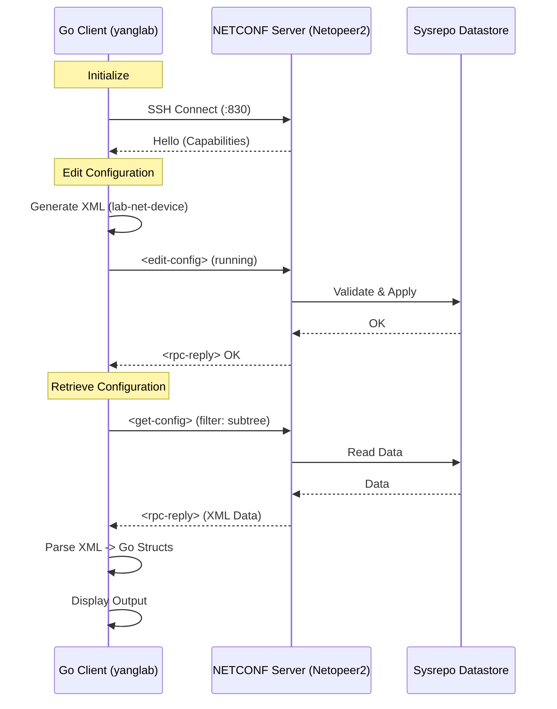

# YANG Lab

Hands-on NETCONF + YANG playground built with Go.

This repository shows how to:
- define a custom YANG module (`yang/lab-net-device.yang`)
- generate NETCONF `<edit-config>` payloads from Go structs
- push config to a running server (Netopeer2)
- retrieve and parse config back from `<get-config>`

## What Is Included

- `cmd/yanglab`: CLI demo that connects to NETCONF, sends config, and reads it back
- `internal/client`: minimal NETCONF client wrapper (`go-netconf`)
- `internal/models/labnetdevice`: model structs, XML generation, and parse helpers
- `yang/lab-net-device.yang`: custom YANG model used by the demo
- `cmd/api`: API skeleton (placeholder, not production-ready)

## System Architecture

The following diagram illustrates the interaction between the Go client and the NETCONF server (Netopeer2):



## Code Quality & Architecture

This project demonstrates several high-quality engineering practices in Go:

### 1. Modular Design
The codebase follows a clean "Standard Go Project Layout":
- **`cmd/`**: Contains the main applications. Usage logic is separated from library code.
- **`internal/`**:  Private application and library code.
    - **`client`**: A reusable, minimal wrapper around the SSH NETCONF session.
    - **`models`**: Domain logic and data structures.

### 2. Type-Safe YANG Modeling
Instead of working with raw maps or loosely typed data, we define **Go structs** that strictly map to the YANG model.
- **Benefits**: Compile-time safety, auto-completion, and clear data contracts.
- **XML Tags**: Struct fields use `xml:"..."` tags to ensure precise marshalling and unmarshalling that matches the NETCONF schema.

### 3. Robust Data Handling
The application handles real-world data intricacies:
- **Custom XML Unmarshalling**: The `labnetdevice.ParseConfig` function is designed to handle both `<config>` and `<data>` wrappers seamlessly.
- **Input Sanitization**: We implement custom logic (see `cleanCharData`) to strip invalid control characters or comments (like `#...`) that might corrupt numeric fields during parsing. This ensures the application is resilient to malformed input.

### 4. Explicit Error Handling
Errors are propagated up the stack and handled explicitly. We avoid silencing errors, ensuring that connection failures, XML generation issues, or parsing errors are clearly reported to the user.


## Prerequisites

- Docker
- Go `1.25+` (see `go.mod`)
- Open port `830` on localhost

## Quick Start

### 1. Start Netopeer2

```bash
docker run -d --name netopeer2 -p 830:830 sysrepo/sysrepo-netopeer2:latest
```

Optional: wait until the server is fully up.

```bash
docker logs -f netopeer2
```

### 2. Install the YANG model into Sysrepo

```bash
docker cp yang/lab-net-device.yang netopeer2:/tmp/
docker exec -it netopeer2 sysrepoctl -i /tmp/lab-net-device.yang
```

Optional check:

```bash
docker exec -it netopeer2 sysrepoctl -l
```

You should see `lab-net-device` in the module list.

### 3. Run the CLI demo

```bash
go mod tidy
go run ./cmd/yanglab
```

Default NETCONF credentials used by the demo:
- host: `127.0.0.1:830`
- username: `netconf`
- password: `netconf`

### 4. (Optional) Run the API skeleton

```bash
go run cmd/api/main.go
```

Current endpoint:
- `GET /api/v1/network` (placeholder response)

## Expected Flow

`cmd/yanglab/main.go` performs:

1. NETCONF SSH connect
2. `<edit-config>` with generated XML from demo data
3. `<get-config>` with subtree filter for:
   - `vlans`
   - `vrfs`
   - `interfaces`
   - `routing`
   - `bgp`
   - `system`
4. parse returned XML into Go structs and print selected values

## Validate the YANG Module (Optional)

If you want static validation/lint before loading the module:

```bash
python -m pip install --upgrade pip
python -m pip install pyang
python -m pyang -f tree yang/lab-net-device.yang
python -m pyang --lint yang/lab-net-device.yang
```

## Troubleshooting

- `unexpected namespace` errors:
  - verify the exact module namespace in `yang/lab-net-device.yang`
  - ensure the loaded module in Sysrepo matches current file contents
- `Edit-Config Failed: ... NACM authorization failed`:
  - this is expected with default Netopeer2 setup, because NACM denies writes for non-recovery users by default
  - quick demo fix: disable NACM in `running` and `startup` (not for production)

```powershell
@'
<nacm xmlns="urn:ietf:params:xml:ns:yang:ietf-netconf-acm">
  <enable-nacm>false</enable-nacm>
</nacm>
'@ | Set-Content -Path .\disable-nacm.xml

docker cp .\disable-nacm.xml netopeer2:/tmp/disable-nacm.xml
docker exec -it netopeer2 sysrepocfg --import=/tmp/disable-nacm.xml --datastore=running --module=ietf-netconf-acm --format=xml
docker exec -it netopeer2 sysrepocfg --import=/tmp/disable-nacm.xml --datastore=startup --module=ietf-netconf-acm --format=xml
```

  - safer alternative: keep NACM enabled and add proper `ietf-netconf-acm` rules for your NETCONF user
- connection errors:
  - confirm container is running and port `830` is mapped

## Project Layout

- `cmd/yanglab/main.go`: CLI entrypoint
- `cmd/yanglab/demo_data.go`: sample payload data
- `cmd/api/main.go`: API skeleton
- `internal/client/client.go`: NETCONF session wrapper
- `internal/models/labnetdevice/labnetdevice.go`: model structs and XML helpers
- `yang/lab-net-device.yang`: custom YANG module
